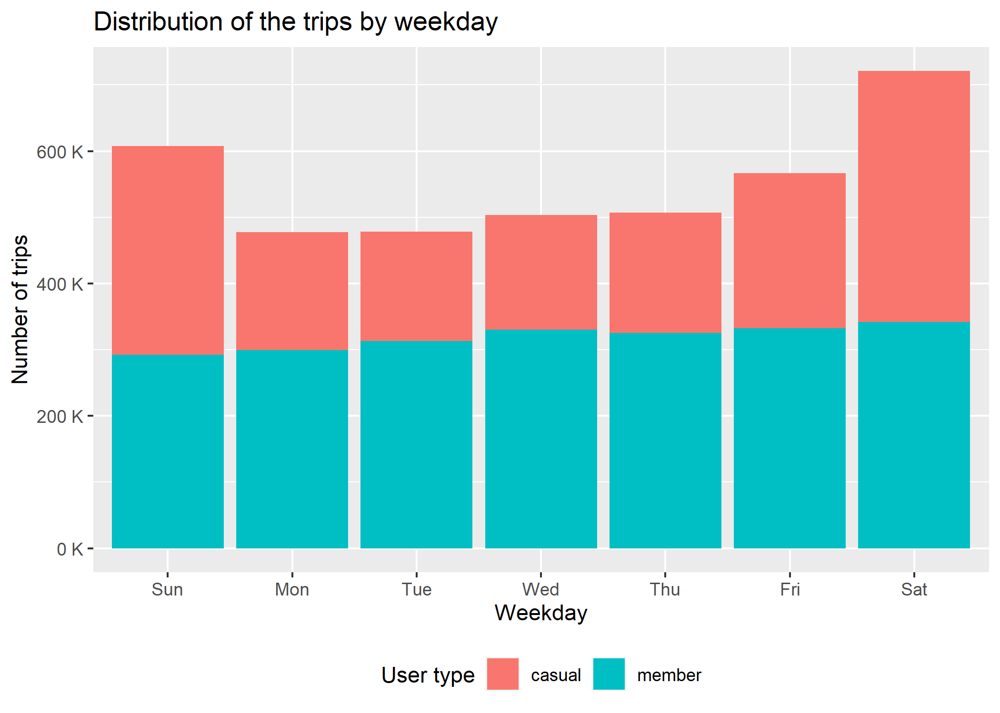
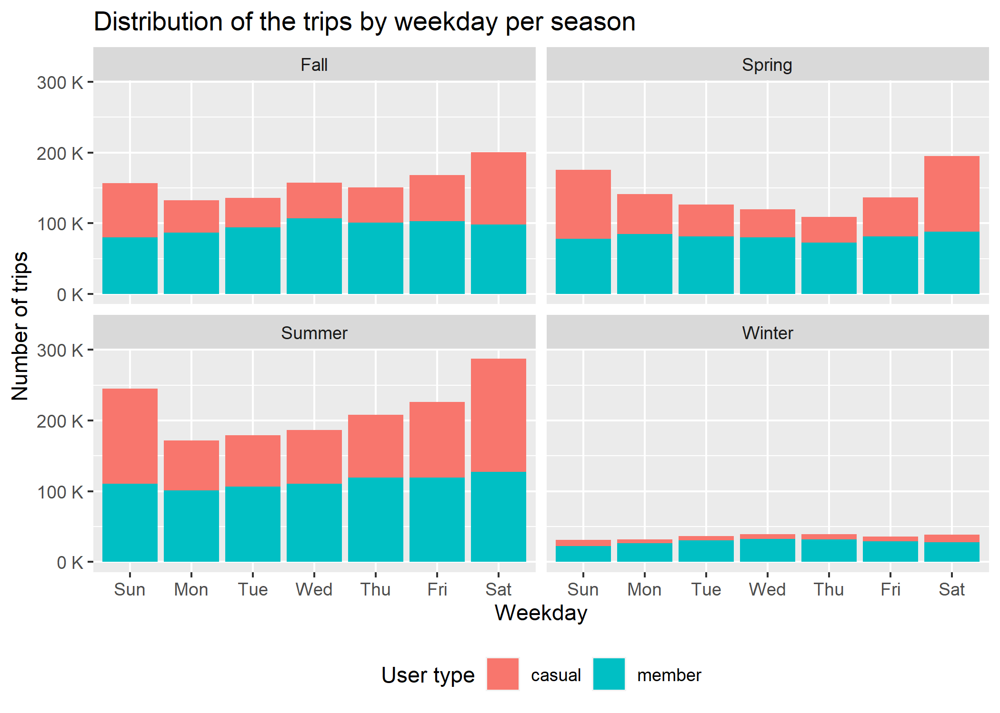
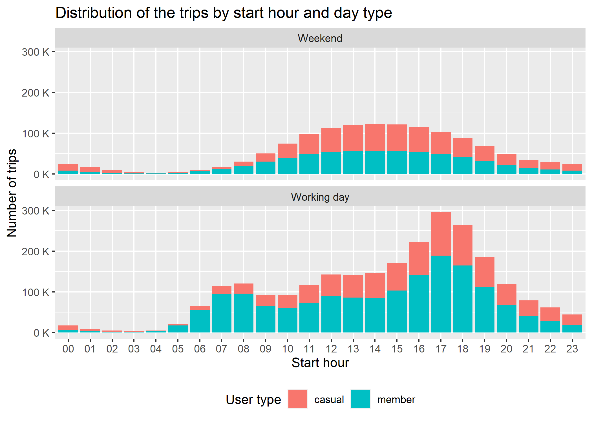

# Summary 

1. [Ask](#ask)

    1.1. [Questions](#1.1)

    1.2. [Good to know](#1.2)

2. [Prepare](#prepare)

    2.1. [General Information about the Data](#2.1)

    2.2. [Merge raw data](#2.2)

    2.3. [Fix the format and organize the data](#2.3)

3. [Process](#process)

    3.1. [Create new variables](#3.1)

    3.2. [Check the data](#3.2)

    3.3. [Clean the data](#3.3)

4. [Analyze](#analyze)

    4.1. [Monthly and seasonal distribution](#4.1)

    4.2. [Weekday and hourly distribution](#4.2)

    4.3. [Distribution per trip length](#4.3)

    4.4. [Further comparison of the trip length](#4.4)

5. [Share and Act](#share)

# 

## 1. Ask 

### 1.1. Questions 
##### [[Back]](#summary)

1. What is the problem that we are trying to solve?

    How to increase the number of annual memberships by **converting casual riders into annual members**. For this, we need to primarily understand **how a casual rider differs from an annual member**.

2. How can the insights drive business decisions?

    The insights can determine the **strategy behind the plan marketing** to increase the number of annual memberships.

3. Who are the clients/stakeholders of the project?

    The direct clients are the **director of marketing and his manager**, and in a broader context, the **executive team** that will approve the marketing program.

### 1.2. Good to know 
##### [[Back]](#summary)

* The company operates in the **Chicago** area, with around 5,800 bikes and 600 stations

* **Casual riders** are clients who purchase single-ride or full-day passes. For single-rides, the price includes 30 minutes of ride time before starting to charge extra per minute. For full-day rides, the price includes unlimited rides of 3h in 24-hour period before any extra charge.

* **Annual members** are clients who purchase an annual pass membership. For these clients, the price includes rides of 45 minutes before starting to charge extra per minute.

* **IMPORTANT**: As a matter of confidentiality of the clients' personally identifiable information, it will not be possible to analyze specific profile information of the customers for this project

## 2. Prepare 

### 2.1. General Information about the Data 
##### [[Back]](#summary)

* Source: Motivate International Inc. [Divvy Trip](https://divvy-tripdata.s3.amazonaws.com/index.html)
* License: [public dataset](https://www.divvybikes.com/data-license-agreement)
* Period: from 2020/June to 2021/May (12 months)
* Extension of archives: .csv

### 2.2. Merge raw data 
##### [[Back]](#summary)

The raw data was stored in 12 csv files, each one corresponding with one month of rides from the company, with 13 columns each with the same information.

As some columns could be of different formats, the data was merged with all columns as characteres.

To merge the files:
<pre><code>cyclistic_trip_data <- 
  list.files(files_path, pattern = "*.csv" ) %>%
  map_df(~read_csv(.x, col_types = cols(.default = "c"))) </code></pre>

### 2.3. Fix the format and organize the data 

The columns of the archive and defined format of each are shown below:
<pre><code>cyclistic_trip_data<- 
  mutate(cyclistic_trip_data,
         ride_id = as.character(ride_id),
         rideable_type = as.character(rideable_type),
         started_at = as_datetime(started_at),
         ended_at = as_datetime(ended_at),
         start_station_name = as.character(start_station_name),
         start_station_id = as.character(start_station_id),
         end_station_name = as.character(end_station_name),
         end_station_id = as.character(end_station_id),
         start_lat = as.double(start_lat),
         start_lng = as.double(start_lng),
         end_lat = as.double(end_lat),
         end_lng = as.double(end_lng),
         member_casual =as.character(member_casual))</code></pre>

Next, we change some of the columns' names to better describe the data:
<pre><code>cyclistic_trip_data <-
  rename(cyclistic_trip_data,
         trip_id = ride_id,
         bike_type = rideable_type,
         started_time = started_at,
         ended_time = ended_at,
         user_type = member_casual)</code></pre>

To finish, the data of latitudes and longitudes will not be used in the analysis. So, four columns were excluded from the data and everything was sorted by the *'started_time'* column.

<pre><code>cyclistic_trip_data <-
  arrange(
    select(cyclistic_trip_data, -start_lat, -start_lng, -end_lat, -end_lng),
    started_time)</code></pre>

## 3. Process  

### 3.1. Create new variables 
##### [[Back]](#summary)

For the following analysis and for sanity check of the data, new variables were created.

<pre><code>cyclistic_trip_data <- 
  distinct(
    mutate(cyclistic_trip_data,
           trip_length = as.double(ended_time - started_time),
           year_month = format(started_time, '%Y-%m'),
           month = format(started_time, '%m'),
           week_day = weekdays(started_time),
           day_type = 
             ifelse(week_day == 'Saturday' | week_day == 'Sunday', 
                    'Weekend',
                    'Working day'),
           start_hour = format(started_time, '%H'),
           check_length = 
             ifelse(trip_length < 0, "neg.", "pos."),
           check_length_1m = 
             ifelse(trip_length < 60, "<1min", ">1min"),
           check_length_1d = 
             ifelse(trip_length >= 86400, ">1day", "<1day"),
           check_station_name = 
             ifelse(start_station_name == end_station_name, "yes", "no"),
           check_station_id = 
             ifelse(start_station_id == end_station_id, "yes", "no")
           ))</code></pre>

Also, to explore change of data with the seasons, the data frame *'season'* was created and a new variable in the main dataset.

<pre><code>season <- data.frame(season = c(rep("Winter", 3), rep("Summer", 3), 
                                rep("Spring", 3), rep("Fall", 3)),
                     month = c('12','01','02', '06', '07', '08', 
                               '03', '04', '05', '09', '10', '11'))
                               
                               cyclistic_trip_data$season <- 
  season$season[match(cyclistic_trip_data$month, season$month)]</code></pre>

### 3.2. Check the data 
##### [[Back]](#summary)

In this phase, it was checked if the data was merged correctly, the main variables in the data set and how the data behaviour based on the trip duration, start and end stations, user type and bike type.

Here, we discovered:
* there was more member rides (approximately +500K) than casual rides in the period analized;
* there was some trips with negative duration, but they are not concentrated in a specific period;
* some stations have more than one id, but this will not interfere directly with the analysis;
* some trips had less than 1 minute of duration, or were greater than 1 day and we need to see how to deal with them;
* the column of bike type distributed per month showed that electric bikes started to be used in August of 2020 and classic bikes in December. With this, this column will not be considered to analysis since the facts are unknown about this.

### 3.3. Clean the data 
##### [[Back]](#summary)

Here, we removed all trips with negative length and trips where the starting station was "HQ QR", because they were trips used for quality assurance.

<pre><code>cyclistic_trip_data <-
  select(
    filter(cyclistic_trip_data, trip_length >= 0, start_station_name != "HQ QR"),
    -bike_type, -month, -check_length, -check_length_1m, 
    -check_length_1d, -check_station_name, -check_station_id)</code></pre>

Then, we saved the cleaned data.

## 4. Analyze 

### 4.1. Monthly and seasonal distribution 
##### [[Back]](#summary)

Here, we evaluate first the seasonal distribution of the trips, where we can see that they are higher in the warm periods of the year, especially the summer. Also, we can see that, in the winter, the rides are more concentrated for members.

One step further, we can compare the monthly average temperature of the Chicago area with the distribution of the trips. Here, we see that in the periods of lower temperatures, the number of trips decrease accordingly and the proportion of member rides increase, and vice-versa.

### 4.2. Weekday and hourly distribution 
##### [[Back]](#summary)

The first view shows the number of trips per weekday and how the number of member rides was almost constant all days of the week, on average. During the weekend, the number of trips increase espeacially due to casual riders.

If we distribute the same graph per season, we can see that the behaviour is similar throught the year in general, except in the winter:

If we analyze by hour, in general the trips are concentrated in the afternoon, with emphasis on the slot 4pm-7pm:

The same behaviour is observed for all seasons:

However, if we evaluate by weekday, the distribution becomes different from the working days to the weekends, as follows. In the weekends, the ditribution were not concentrated, different from the working days where the concentration was around the time that people finish their work, bewtween 4pm and 7pm.

### 4.3. Distribution per trip length 
##### [[Back]](#summary)

Recalling the rules for "free" rides (rides without extra charge per minute) for members and casual riders:
* Members: 45 minutes
* Casual riders:
    * Single ticket: 30 minutes
    * Day trip: 3 hours

With this information, we decided to evaluate the distribution of trips with a maximum length of 3 hours. The histogram shows the concentration is for trips with less than 1 hour:

From this, we decided to categorize the trips in 6 groups to evaluate the differences between casual riders and members:

It is clear that members prefer to stay inside the 45 minutes of their "free" rides, with a higher concentration in rides with less than 15 minutes. 

On the other hand, casual riders have also a higher concentration in trips with less than 30 minutes, but they can also choose longer rides. This can occur due to the differences between single and day tickets, but we can not explain precisely since we do not have the ticket information in the data base.

### 4.4. Further comparison of the trip length 
##### [[Back]](#summary)

*For this analysis, we desconsidered the trips with more than 3 hours.*

Ploting the quartiles of the trip length per user type, we can see that the median for casual riders is higher than for members. In general, members have a tendency for shorter trips.

As expected, if we run the same analysis for each season, it is clear that the trips had higher length during warm periods, especially for casual riders during summer, although members has a smaller variation through the seasons in the median legnth of their trips.

Also, in both graphs we can see a pattern where casual rides varies more in duration than for members, as shown for their percentiles.

Now, if we analyze the same graph for working and weekend days, the biggest variation in length is for casual rides, although the difference in median length is not expressive.

Members, as for the number of rides, had a more consistent patter between all week.

And the last view is from the difference in the trip length through the day. Casual rides had a bigger variation in the median length for different start hours than members.

## 5. Share and Act 
##### [[Back]](#summary)

For this case study, we showed the results above, with all the analysis and premises taken. The main facts from the data that states the answer for the initial question "how a casual rider differs from an annual member?" are:

1. during winter, the majority of the rides are from members and the proportion of casual rides increase with the increase of the temperature;

2. the number of member rides during the week stays almost constant. However, the number of casual riders varies and are higher during weekends, except in the winter;

3. by analyzing the hour profile of the data, we can see that both casual and member rides follows a concentration by the end of the day (back from work?) from Monday to Friday, with a slightly increase for member rides in the begining of the morning (going to work?). In the weekends, the profile of the distribution was consistent from 10am to 19pm;

4. members have a tendency of staying inside their 45 minutes of "free" rides and they have a huge concentration of rides with less than 15 minutes. On the other hand, although the distribution of casual rides has a concentration for lengths smaller than 30 minutes, the behaviour is different from members and can be explained by single and day tickets.

From the differences in number of trips and duration of the trips, casual riders showed more variation during seasons, weekdays and time of the day and the trips had a bigger range for duration when compared with members in any situation. 

From this, a point of view is that members enjoy more the bikes for shorter trips in their own routines, while casual riders usually have a variety of reasons to use the bikes, that reflect in the bigger differences that we just mentioned in duration and number of trips. Also, casual riders has two options with really different periods for their "free" rides depending if they buy a single or day ticket, that we could not explore further here.

Other important facts:

1. the number of member rides were higher than the casual ones (approximately +500k);

2. the type of bike used seemed to be not cohesive in the database and suggest an error or business decisions that we are not aware of in this analysis;

3. some stations have more than one id, suggesting that the data base needs to be corrected;

4. the analysis could go further with information like type of tickets and motive of the trips. The only parameters to evaluate were the trip duration through different periods of the year, week and day.